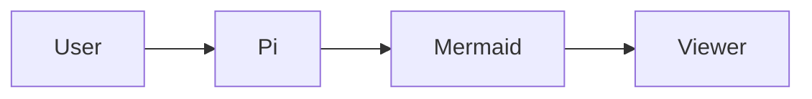

# pi-extension-mermaid

[](https://github.com/vindulaintranet/pi-extension-mermaid/actions/workflows/ci.yml)
[](https://github.com/vindulaintranet/pi-extension-mermaid/releases)
[](./LICENSE)

Render Mermaid fenced blocks inline in [Pi](https://github.com/badlogic/pi-mono), then open the same diagrams in a larger SVG viewer when you need more space.

Created by [Fabio Rizzo Matos](https://github.com/fabiorizzomatos) · `fabiorizzo@vindula.com.br`

## Highlights

- inline Mermaid previews in Pi chat
- `/mermaid-open` to open the latest diagram directly in the browser
- `/mermaid` and `Ctrl+Shift+M` for a session-level viewer
- real SVG-based rendering with terminal image previews
- ASCII fallback when inline image protocols are unavailable

## Install

### Latest from GitHub

```bash
pi install git:github.com/vindulaintranet/pi-extension-mermaid
```

### Pin to a release

```bash
pi install git:github.com/vindulaintranet/pi-extension-mermaid@v0.1.0
```

### Local development checkout

```bash
pi install /absolute/path/to/pi-extension-mermaid
```

Then restart Pi or run:

```text
/reload
```

## Commands and shortcut

| Action | What it does |
| --- | --- |
| `/mermaid-open` | Opens the latest Mermaid diagram directly in the browser |
| `/mermaid` | Opens the multi-diagram viewer for the current session |
| `Ctrl+Shift+M` | Shortcut for the multi-diagram viewer |

## Typical flow

Ask Pi or your model to answer with a fenced Mermaid block:

````markdown

````

What happens next:

1. the extension detects Mermaid fences in assistant responses and user prompts
2. the diagram is rendered inline in the chat
3. the extension stores the diagram metadata outside the LLM context
4. you can open a larger view with `/mermaid-open` or `/mermaid`

## Rendering model

### Inline preview

When the terminal supports inline images, the extension renders a PNG preview derived from normalized Mermaid SVG.

Best experience:
- Ghostty
- Kitty
- WezTerm
- iTerm2

If the terminal does not support inline images, the extension falls back to ASCII output instead of failing.

### Large view

#### `/mermaid-open`

This is the most reliable way to inspect a diagram at full size.

It opens the latest Mermaid diagram directly in the browser using the local system opener:
- `open` on macOS
- `xdg-open` on Linux
- `start` on Windows

#### `/mermaid` and `Ctrl+Shift+M`

These open the session viewer.

The viewer tries to open a browser-based SVG experience first. If that is not possible, it falls back to the terminal viewer.

## Terminal hyperlink note

The inline preview also shows an `abrir grande` hyperlink.

That link is convenient, but terminal behavior varies. Some terminals do not open local `file://` links reliably from OSC 8 hyperlinks. When in doubt, prefer:

```text
/mermaid-open
```

## How it works

- `beautiful-mermaid` generates the Mermaid SVG
- the SVG is normalized so `@resvg/resvg-js` can rasterize it predictably
- the extension keeps both:
  - a PNG version for inline terminal previews
  - an SVG version for large browser viewing
- custom Mermaid messages are filtered out of the LLM context
- assistant previews are appended after `agent_end` so the preview does not appear to duplicate or reorder the original reply

## Development

```bash
npm install
npm run validate
```

Validation includes:
- extraction helper tests
- SVG normalization and PNG generation tests
- bundle validation for the Pi extension entrypoint
- `npm pack --dry-run`

## Release model

This repository is meant to be installed from Git refs, not from the npm registry.

- branch installs move with `pi update`
- tag installs stay pinned until the user chooses a newer tag

Example pinned install:

```bash
pi install git:github.com/vindulaintranet/pi-extension-mermaid@v0.1.0
```

## Repository layout

- `mermaid.ts` — Pi extension entrypoint
- `mermaid-extract.ts` — Mermaid fence extraction helpers
- `mermaid-render.ts` — SVG normalization, PNG rasterization, cache
- `mermaid-viewer.ts` — browser/terminal viewer logic
- `test/` — extraction and renderer tests
- `docs/agent/notes/` — implementation notes for non-trivial changes

## Contributing

See:
- [CONTRIBUTING.md](./CONTRIBUTING.md)
- [RELEASING.md](./RELEASING.md)

## License

MIT
