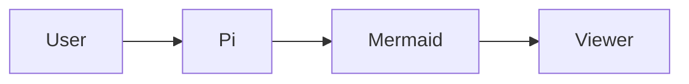

# pi-extension-mermaid

[](https://github.com/vindulaintranet/pi-extension-mermaid/actions/workflows/ci.yml)
[](https://github.com/vindulaintranet/pi-extension-mermaid/releases)
[](./LICENSE)

A standalone [Pi](https://github.com/badlogic/pi-mono) package that detects Mermaid fenced blocks, renders clean terminal previews when they fit, and opens a proper SVG viewer for full-quality inspection.

Created by [Fabio Rizzo Matos](https://github.com/fabiorizzomatos) · contact: `fabiorizzo@vindula.com.br`

## What it does

This package gives Pi two Mermaid-focused behaviors:

- detects fenced ```` ```mermaid ```` blocks in assistant responses and user prompts
- shows an inline preview when the diagram fits the terminal well
- opens a full SVG viewer with:
  - `Ctrl+Shift+M`
  - `/mermaid`

So if the operator or agent emits Mermaid in a normal fenced block, Pi can surface it visually instead of leaving only the raw code visible.

## Install

### From GitHub

```bash
pi install git:github.com/vindulaintranet/pi-extension-mermaid
```

### Pin to a release tag

```bash
pi install git:github.com/vindulaintranet/pi-extension-mermaid@v0.1.0
```

### From a local path

```bash
pi install /absolute/path/to/pi-extension-mermaid
```

After installing, restart Pi or run:

```text
/reload
```

## Usage

Ask Pi or your model to answer with a Mermaid fenced block:

````markdown

````

What happens:
- the message gets scanned for Mermaid fences
- compact diagrams can render inline in the chat stream
- large or tall diagrams skip the inline preview instead of spamming the terminal
- `/mermaid` and `Ctrl+Shift+M` open the full SVG viewer

## Rendering model

### Inline preview

On terminals with inline image support, the extension renders PNG previews derived from Mermaid SVG.

Supported terminals include:
- Kitty
- Ghostty
- WezTerm
- iTerm2

If a diagram would be too large for a sane inline preview, the extension shows a compact hint instead of forcing an unreadable giant image.

### Full viewer

`/mermaid` and `Ctrl+Shift+M` try to open a browser-based SVG viewer first.

That viewer:
- uses the real Mermaid SVG
- keeps the diagram sharp
- lets the browser handle scrolling for large flowcharts
- supports previous/next navigation for multiple diagrams

If opening the browser is not possible, the extension falls back to the terminal viewer.

### Fallbacks

- no image protocol in terminal → ASCII fallback inline
- browser viewer unavailable → terminal image viewer
- no terminal image support either → ASCII viewer

## Implementation notes

- Uses [`beautiful-mermaid`](https://www.npmjs.com/package/beautiful-mermaid) to generate Mermaid SVG.
- Uses [`@resvg/resvg-js`](https://www.npmjs.com/package/@resvg/resvg-js) to rasterize terminal previews.
- Normalizes the generated SVG before rasterization so `resvg` does not choke on CSS variables and `color-mix()` derived colors.
- Stores diagram metadata in custom Pi session messages so diagrams survive normal session flow.
- Filters those custom messages out of LLM context, so the model does not see internal rendering payloads.

## Quality checks

Run everything locally with:

```bash
npm install
npm run validate
```

This runs:
- unit tests for Mermaid block extraction helpers
- renderer tests for SVG normalization and PNG generation
- bundle validation for the Pi extension entrypoint
- `npm pack --dry-run` to validate package contents

## Contributions

If you want to contribute:

1. fork the repository
2. create a branch
3. run `npm run validate`
4. open a pull request

See:
- [CONTRIBUTING.md](./CONTRIBUTING.md)
- [RELEASING.md](./RELEASING.md)

## How updates reach Pi users

### Users installed from the default branch

```bash
pi install git:github.com/vindulaintranet/pi-extension-mermaid
```

They can later run:

```bash
pi update
```

and Pi will pull the latest package state from the default branch.

### Users installed from a pinned tag

```bash
pi install git:github.com/vindulaintranet/pi-extension-mermaid@v0.1.0
```

Pinned installs do not move automatically on `pi update`. They stay on that exact ref until the user upgrades intentionally.

## Package manifest

This repository is a Pi package via `package.json`:

```json
{
  "keywords": ["pi-package"],
  "pi": {
    "extensions": ["./mermaid.ts"]
  }
}
```

## License

MIT
